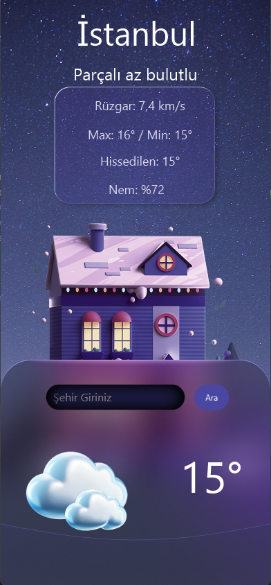

# 🌤️ WeatherApp - Hava Durumu Uygulaması

JavaFX tabanlı masaüstü hava durumu uygulaması. OpenWeatherMap API kullanarak gerçek zamanlı hava durumu verilerini çeker ve görsel olarak sunar.

## 📸 Ekran Görüntüsü



## 🚀 Özellikler

- ✅ Gerçek zamanlı hava durumu verileri
- ✅ Şehir bazlı arama
- ✅ Sıcaklık, nem, rüzgar hızı gösterimi
- ✅ Dinamik hava durumu ikonları
- ✅ Modern ve şık arayüz
- ✅ SOLID prensiplerine uygun mimari

## 🛠️ Teknolojiler

| Teknoloji | Versiyon |
|-----------|----------|
| Java | 17 |
| JavaFX | 17.0.6 |
| Maven | 3.x |
| OpenWeatherMap API | 2.5 |

## 📁 Proje Yapısı

```
src/main/java/com/weather/
├── Main.java                    # Uygulama giriş noktası
├── WeatherController.java       # UI Controller
├── model/
│   └── WeatherData.java        # Veri modeli
├── service/
│   ├── IWeatherService.java    # Servis interface
│   ├── OpenWeatherMapService.java
│   └── WeatherServiceException.java
└── mapper/
    ├── IWeatherIconMapper.java # İkon mapper interface
    └── WeatherIconMapper.java
```

## 🏗️ SOLID Prensipleri

| Prensip | Uygulama |
|---------|----------|
| **S** - Single Responsibility | Her sınıf tek iş yapar |
| **O** - Open/Closed | Interface'ler ile genişletilebilir |
| **L** - Liskov Substitution | Farklı servis implementasyonları kullanılabilir |
| **I** - Interface Segregation | Küçük, odaklı interface'ler |
| **D** - Dependency Inversion | Controller interface'lere bağlı |

## ⚙️ Kurulum

### Gereksinimler
- Java 17+
- Maven 3.x
- IntelliJ IDEA (önerilen)

### Çalıştırma

**IntelliJ IDEA ile:**
1. Projeyi açın
2. `Main.java` dosyasını çalıştırın

**Maven ile:**
```bash
mvn clean javafx:run
```

## 🔑 API Anahtarı

Uygulama OpenWeatherMap API kullanır. API anahtarını değiştirmek için:

```java
// WeatherController.java
private static final String API_KEY = "YOUR_API_KEY";
```

[OpenWeatherMap](https://openweathermap.org/api) adresinden ücretsiz API anahtarı alabilirsiniz.

## 📝 Lisans

Bu proje eğitim amaçlı geliştirilmiştir.

---

**Geliştirici:** Emre  
**Tarih:** Ocak 2026
